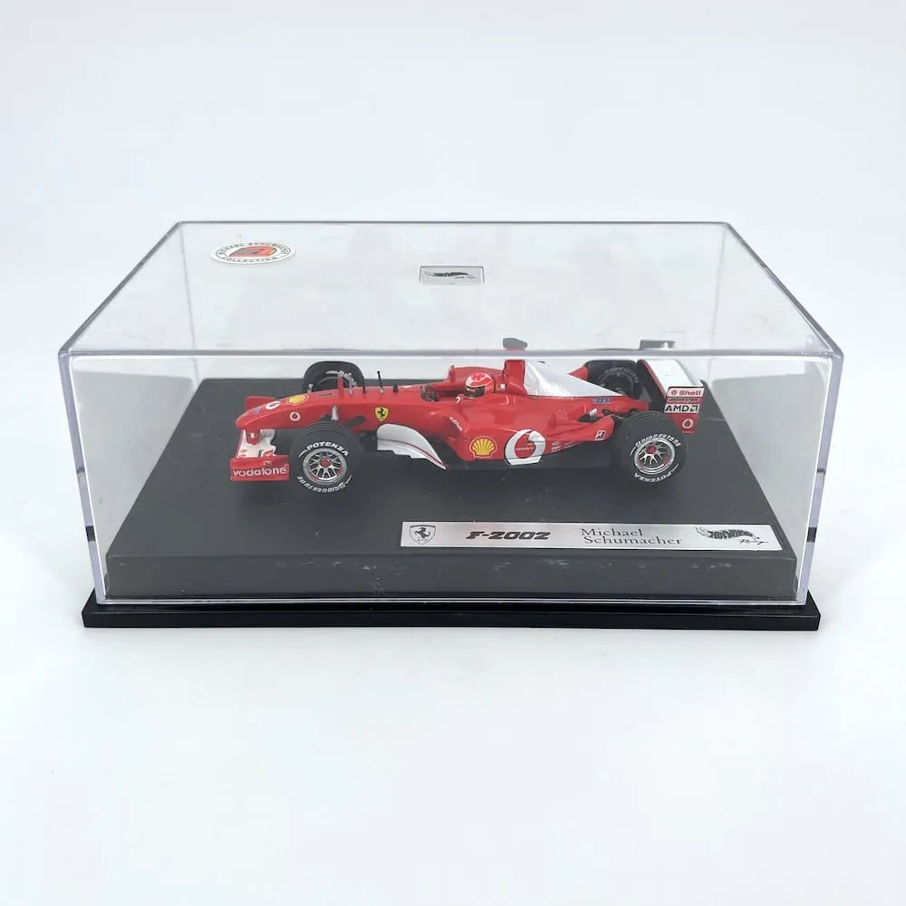

# PC8Store — F1 Official Store

> E-commerce di merchandising e modellini Formula 1, interamente responsive e sviluppato con HTML, CSS e JavaScript vanilla.

---

## Descrizione

PC8Store è un sito e-commerce specializzato in prodotti a tema Formula 1: modellini in scala 1:43, abbigliamento ufficiale team, accessori e gadget. Il progetto è stato realizzato come sito statico completo, con carrello funzionante via localStorage, filtri di ricerca, ordinamento per prezzo e applicazione codici sconto.

Il design è ispirato all'estetica racing: palette scura con accenti rossi, tipografia Montserrat, animazioni hover sulle card prodotto e un'identità visiva coerente con il mondo della Formula 1.

---

## Struttura del Progetto

```
PC8Store/
│
├── index.html              # Homepage con hero video e prodotti top seller
├── shop-online.html        # Catalogo completo con filtri e ricerca
├── carrello.html           # Carrello con riepilogo ordine e sconti
├── FAQ.html                # Domande frequenti (accordion)
├── Chi-siamo.html          # Pagina "Chi Siamo" con storia e valori
│
├── style.css               # Foglio di stile unico, completamente responsive
├── script.js               # Logica shop: filtri, ordinamento, carrello
├── carrello.js             # Logica carrello: gestione prodotti, sconti, totali
│
└── img/                    # Asset grafici (logo, foto prodotti, gif, video)
    ├── logo.png
    ├── prodotti/
    │   ├── Rb21 Japan.jpg
    │   ├── F108.webp
    │   ├── F2002.webp
    │   └── ...
    └── gifs/
        ├── RB21 Japan.gif
        ├── F1.08.gif
        └── ...
```

---

## Tecnologie Utilizzate

| Tecnologia | Uso |
|------------|-----|
| **HTML5** | Struttura semantica delle pagine |
| **CSS3** | Styling completo con Flexbox, CSS Grid, media queries, clamp() per tipografia fluida |
| **JavaScript (ES6)** | Logica interattiva: carrello, filtri, localStorage |
| **Font Awesome 6** | Icone (carrello, email, WhatsApp, frecce) |
| **Google Fonts** | Famiglia Montserrat (300, 400, 600, 700, 800) |

Nessun framework CSS o JS esterno (Bootstrap, jQuery, React, ecc.). Il sito è 100% vanilla.

---

## Funzionalità

### Shop Online
- **Ricerca testuale** in tempo reale per nome prodotto e descrizione
- **Filtro per marchio** (Ferrari, Red Bull, Mercedes, McLaren, Williams, BMW Sauber)
- **Ordinamento per prezzo** (crescente / decrescente / tutti)
- **Card prodotto** con immagine statica che si anima al hover (gif/video)
- **Aggiunta al carrello** con quantità massima 10 per prodotto

### Carrello
- **Visualizzazione prodotti** con immagine, nome, prezzo, quantità
- **Modifica quantità** in tempo reale (min 1, max 10)
- **Rimozione prodotti** singoli
- **Calcolo automatico** subtotale, sconto, spedizione, totale
- **Soglia spedizione gratuita** ≥ €150
- **Codici sconto** predefiniti:
  - `PUCCIOTTO97` → sconto 97%
  - `15MAGGIO` → sconto 15%
- **Contatore carrello** nella navbar
- **Persistenza dati** via localStorage (si mantiene dopo refresh)

### FAQ
- Accordion in HTML nativo (`<details>` / `<summary>`)
- 12 domande/risposte su prodotti, spedizioni, resi
- Freccia animata che ruota all'apertura

### Chi Siamo
- Hero section tematica
- Sezioni: Origini, Missione (3 pilastri), Prodotti, Valori (4 punti), Statistiche, Team, Perché sceglierci, Futuro
- Call-to-action finale
- Footer completo con navigazione, contatti, copyright

---

## Responsive Design

Il sito è completamente responsive con approccio **mobile-first**:

| Breakpoint | Layout |
|------------|--------|
| > 1800px | Shop: 5 colonne |
| > 1400px | Shop: 4 colonne |
| 1100-1400px | Shop: 3 colonne, navbar orizzontale |
| 700-1100px | Shop: 2 colonne, navbar si impila |
| < 900px | Hero ridotto, card carrello verticali |
| < 700px | Shop: 1 colonna, menu a capo |
| < 600px | Valori centrati, numeri 1 colonna |
| < 500px | Card prodotto full-width, immagini 200px |
| < 400px | Font ridotti, padding minimi |

Tecniche CSS utilizzate:
- `clamp()` per tipografia fluida
- `min()`, `max()`, `calc()` per dimensioni adattive
- CSS Grid per le griglie prodotti
- Flexbox per layout flessibili
- `box-sizing: border-box` su tutti gli elementi
- `overflow-x: hidden` per prevenire scroll orizzontale

---

## Come Usare

### 1. Clonare o scaricare i file
Copia tutti i file HTML, CSS, JS e la cartella `img/` nella stessa directory.

### 2. Aprire il sito
Apri `index.html` in qualsiasi browser moderno. Non richiede server (è un sito statico), ma per il localStorage alcuni browser potrebbero richiedere il protocollo `http://` invece di `file://`. In tal caso:

```bash
# Opzione A: Python simple server
python -m http.server 8000

# Opzione B: Node.js live-server
npx live-server

# Opzione C: VS Code extension "Live Server"
```

Poi visita `http://localhost:8000`.

### 3. Personalizzare prodotti
Per aggiungere/modificare prodotti, edita `shop-online.html`:

```html
<div class="prodotto" data-brand="ferrari" data-price="123.99">
    <div class="video-container">
        
        
    </div>
    <div class="product-info">
        <h3>Modellino 1:43 Ferrari</h3>
        <p>Modellino 1:43 Ferrari F2002 anno 2002 Michael Schumacher</p>
        <span class="product-price">€123.99</span>
        <button class="aggiungi">Aggiungi al carrello</button>
    </div>
</div>
```

**Attributi obbligatori:**
- `data-brand`: marchio per il filtro (lowercase)
- `data-price`: prezzo numerico per l'ordinamento
- `class="img-sopra"` per modellini, `class="accessori"` per abbigliamento/accessori

### 4. Personalizzare codici sconto
Modifica in `carrello.js`:

```javascript
const codiciSconto = {
    "NOMECODICE": 20,  // 20% di sconto
    "BLACKF1": 50
}
```

---

## Browser Support

| Browser | Versione minima |
|---------|-----------------|
| Chrome | 90+ |
| Firefox | 88+ |
| Safari | 14+ |
| Edge | 90+ |
| Opera | 76+ |

Richiede supporto per:
- CSS Grid e Flexbox
- `clamp()`, `min()`, `max()`
- localStorage API
- ES6 (arrow functions, template literals, `const`/`let`)

---

## Note Tecniche

### localStorage
Il carrello utilizza `localStorage` per memorizzare i dati. I dati persistono finché l'utente non cancella la cache del browser. Struttura dati:

```json
[
  {
    "nome": "Modellino 1:43 RedBull",
    "prezzo": 73.99,
    "img": "img/Rb21 Japan.jpg",
    "desc": "Modellino 1:43 RedBull RB21 2025...",
    "quantita": 2
  }
]
```

### Performance
- Immagini ottimizzate in formato WebP dove possibile
- Video/GIF caricati solo al hover (lazy effect naturale)
- Nessuna dipendenza esterna pesante
- CSS unico per ridurre le richieste HTTP

### Accessibilità
- `prefers-reduced-motion` rispettato
- Colori con contrasto WCAG AA
- Tag `alt` sulle immagini
- Struttura semantica HTML5

---

## Autore

**PC8Store Team** — Appassionati di Formula 1 e collezionisti

- Email: pc8store@gmail.com
- WhatsApp: disponibile
- Fondatore: Pucciotto

---

## Licenza

Tutti i prodotti presenti nello store sono originali e realizzati da produttori autorizzati con licenza ufficiale Formula 1 e team partner.

© 2025 PC8Store — Tutti i diritti riservati.

---

## Roadmap Futura

- [ ] Modellini scala 1:18 e 1:24
- [ ] Edizioni limitate esclusive
- [ ] Sistema utenti con login
- [ ] Pagamento online integrato (Stripe/PayPal)
- [ ] Newsletter con offerte dedicate
- [ ] Community online per collezionisti
- [ ] Showroom fisico

---

## Contribuire

Il progetto è a scopo didattico e commerciale. Per suggerimenti, bug o nuove idee:
1. Contatta l'email sopra indicata
2. Descrivi il problema o la feature richiesta
3. Attendi risposta dal team (tempo medio: 24h)

---

**Grazie per aver visitato PC8Store. Ci vediamo sul circuito!** 🏎️
